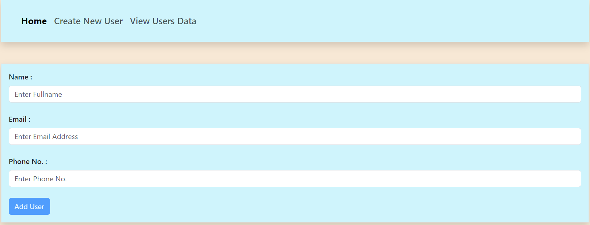
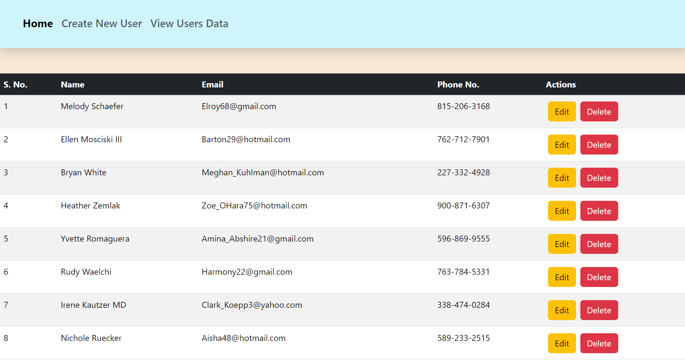

## React - Axios - Task

Creating a **`React App`** that allows for `CRUD operations` with User Data using React and **`Axios` `fetch`** to interact with a mock API 
 
 

- Created a welcome page

  

- Created a form to collect user details

- On submission of the formm data, the data will be added to API data along with existing data.

  

- Here the saved datas will be displayed in a table format.

- have provided two buttons `Edit` and `Delete` to `Update` and `Remove` user data respectively.

